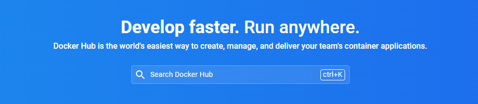
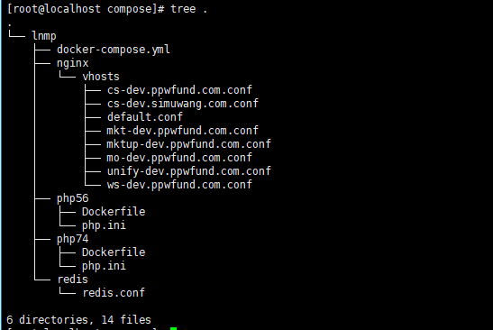
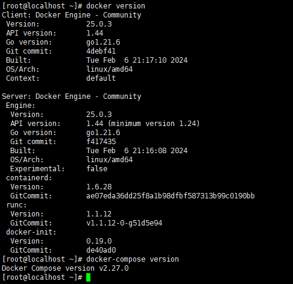
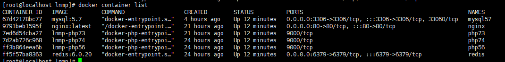

# docker-compose-dev
  Compose 是用于定义和运行多容器 Docker 应用程序的工具。通过 Compose，您可以使用 YML 文件来配置应用程序需要的所有服务。然后，使用一个命令，就可以从 YML 文件配置中创建并启动所有服务。
  本文介绍开发环境下利用docker-compose构建环境：php5.6、php7.3、php7.4、mysql、nginx、redis

## compose相关文件结构

## 宿主机环境

## 已启动的服务

## 基本步骤
- 准备一台linux虚拟机（宿主机）
- 宿主机中安装 docker、docker-compose
- 在宿主机中创建容器需要保存数据的目录，如redis持久化和mysql数据保存的目录
  - redis： /data/redis
  - mysql: /data/mysql57
- Compose 使用的三个步骤
  - 使用 Dockerfile 定义应用程序的环境
  - 使用 docker-compose.yml 定义构成应用程序的服务，这样它们可以在隔离环境中一起运行
  - 最后，执行 docker-compose up 命令来启动并运行整个应用程序
- Dockerfile 配置介绍
- 按照 LNMP 文件夹目录接口创建Dockerfile文件和启动容器所需的相关配置文件
- docker-compose up -d #后台启动服务
- docker-compose build php56 #命令为php56重建映像，然后停止、销毁和重新创建web服务。
- docker-compose up --no-deps -d php56 #no-deps标志阻止Compose重新创建web依赖的任何服务。

## 其他
- 查找镜像：https://hub.docker.com/
- compose介绍：https://docs.docker.com/compose/production/
- 部分镜像支持配置环境变量，详情具体可查看hub.docker.com中的介绍：如mysql中提供容器设置root密码：https://hub.docker.com/_/mysql
- Dockerfile相关命令：https://docs.docker.com/reference/dockerfile/#workdir
- 优秀博主文章链接：https://juejin.cn/post/7119171318024503303